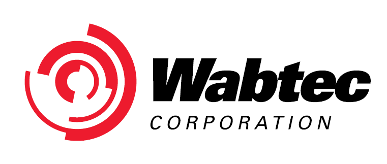
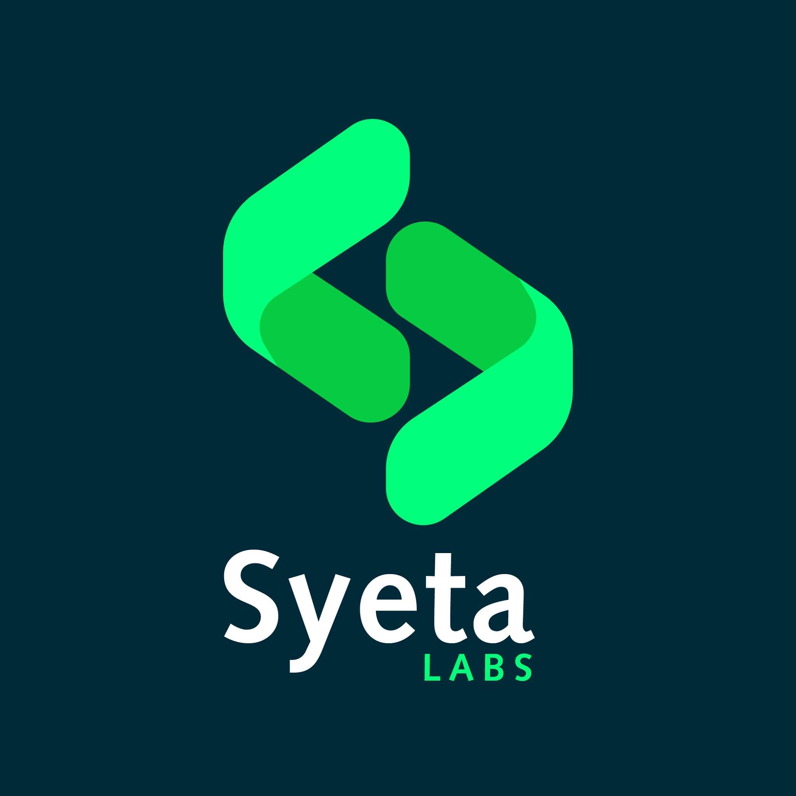

# Hello!   I'm Lahiru Kumara

### Education 👩‍🎓
<a>BSC Eng.Hons, Department Computer Science and Engineering  University of Moratuwa </a>

<!-- ### Experiences 👨‍💻
- Trainee Software Engineer at Wabtec corporation 
- Software Engineer at Syeta Labs  -->
<!-- 
  

✔ Pronouns: ***He/His*** or ***TeamMaker***😉  
✔ I’m currently working on **ReactJS** & **NodeJS** 
✔ Fun fact : *Still waiting for my letter from Hogwarts*    -->
 

### Programming Languages 

### Technologies and Tools 🛠️

#### Frameworks

### Databases and cloud hosting

    
    
    
    
    
    

#### Other areas

#### tools

### Let's Connect :coffee:

	
	
	
    <!-- 
    
	
	
    
    

### ⚙️ &nbsp;GitHub Analytics -->

